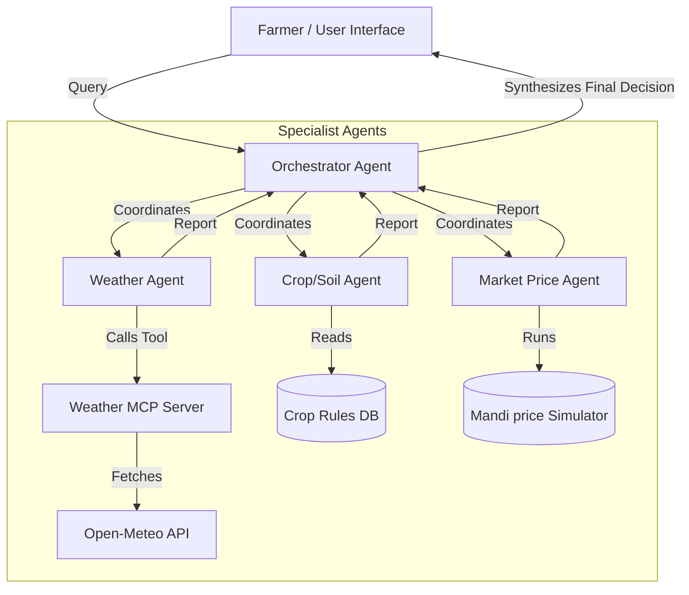

# 🌾 KisanMitra (Farmer's Friend) Multi-Agent AI System

KisanMitra is a multi-agent AI system designed for Indian farmers. It consolidates weather forecasts, crop/soil compatibility analysis, and mandi (market) price trends into **one single, simple, and trustworthy farming recommendation** (e.g., *"Wait 3 days to sell wheat — rain is expected, and prices are projected to rise by 6%"*).

This project was built for the **Kaggle Capstone Project** under the **"Agents for Good"** track, utilizing concepts from Google's Agent Development Kit (ADK) and the Model Context Protocol (MCP).

---

## 🏗️ System Architecture

KisanMitra uses a hierarchical multi-agent coordination pattern:



### 1. Orchestrator Agent
* **File**: `[agents/OrchestratorAgent.js](file:///d:/kisan-mitra-ai/agents/OrchestratorAgent.js)`
* **Role**: The main coordinator. It parses the farmer's location, crop type, and soil, invokes the three specialist agents in parallel, and passes their structured reports to Gemini to synthesize a final, highly simplified action recommendation and one-line reasoning. It outputs in both English and Hindi.

### 2. Weather Agent
* **File**: `[agents/WeatherAgent.js](file:///d:/kisan-mitra-ai/agents/WeatherAgent.js)`
* **Role**: Spawns and connects to the Weather MCP Server using standard **stdio transport**. It requests weather forecast data and leverages Gemini to translate and interpret the weather conditions into specific agricultural advisories (e.g., whether to spray pesticides or irrigate). It features an automated direct-fetch fallback if the MCP server transport is unavailable.

### 3. Crop/Soil Agent
* **File**: `[agents/CropSoilAgent.js](file:///d:/kisan-mitra-ai/agents/CropSoilAgent.js)`
* **Role**: Evaluates the biological suitability of the crop for the selected soil type. It references a local rule-based agricultural database containing preferred soils, seasonal windows, watering requirements, fertilizer inputs, and pest threats for popular Indian crops (Wheat, Rice, Cotton, Mustard, Sugarcane) and optimizes its recommendations using Gemini.

### 4. Market Price Agent
* **File**: `[agents/MarketAgent.js](file:///d:/kisan-mitra-ai/agents/MarketAgent.js)`
* **Role**: Simulates historical (30-day) and projected (7-day) mandi prices relative to the Government Minimum Support Price (MSP) for various agricultural states. It uses Gemini to analyze the trend sentiment (Rising/Falling/Stable) and generates a strict "SELL NOW" or "HOLD / WAIT" recommendation.

### 5. Weather MCP Server
* **File**: `[mcp-server/index.js](file:///d:/kisan-mitra-ai/mcp-server/index.js)`
* **Role**: Exposes a `get_weather_forecast` tool using the official `@modelcontextprotocol/sdk`. It wraps the free, public Open-Meteo API to fetch coordinate-based temperature, weather codes, and precipitation probabilities.

---

## 🛠️ Tech Stack
* **Frontend**: Next.js 15 (React, TypeScript, Tailwind CSS v4, Lucide Icons, Recharts for dynamic mandi graphs).
* **Backend**: Node.js, Express (REST API, Agent orchestration).
* **Agent Engine**: Google Gen AI SDK (`@google/genai`) invoking `gemini-2.5-flash` with structured JSON schema outputs.
* **Integrations**: Model Context Protocol (MCP) Stdio Server/Client transport.

---

## 🚀 How to Run Locally

### Prerequisites
* Node.js (v18 or higher recommended, tested on Node v24)
* A Google Gemini API Key (from [Google AI Studio](https://aistudio.google.com/))

### Step 1: Clone and Install Workspace Dependencies
First, install the root dependencies which are shared by the agents:
```bash
# Install root package dependencies
npm install

# Install MCP server dependencies
cd mcp-server
npm install
cd ..

# Install Backend dependencies
cd backend
npm install
cd ..

# Install Frontend dependencies
cd frontend
npm install
cd ..
```

### Step 2: Configure Environment Variables
Create a `.env` file in the `backend/` directory:
```bash
cp backend/.env.example backend/.env
```
Open `backend/.env` and paste your Gemini API key:
```env
PORT=5000
GEMINI_API_KEY=AIzaSyD...your_actual_key_here
```

### Step 3: Run Standalone Verification Tests
Before starting the servers, you can run isolation tests to ensure MCP and Gemini connections are functional:
```bash
cd backend
# 1. Test Weather MCP Server and Open-Meteo fetch
node test-mcp.js

# 2. Test Agent orchestration pipeline (uses Gemini or fallbacks)
node test-agents.js
cd ..
```

### Step 4: Start Backend and Frontend
In two separate terminals, run the backend and frontend servers:

**Terminal 1 (Backend)**:
```bash
cd backend
npm run dev
# Server will start on http://localhost:5000
```

**Terminal 2 (Frontend)**:
```bash
cd frontend
npm run dev
# App will start on http://localhost:3000
```
Open [http://localhost:3000](http://localhost:3000) in your browser.

---

## 🌐 Deployment Instructions

KisanMitra is configured for quick and easy deployment on cloud platforms. The frontend is optimized for **Vercel** and the backend is configured for **Render**.

### 💻 Backend Deployment (Render)

The backend Express app hosts the agent pipeline and coordinates the Weather MCP server via standard stdio transport. Follow these steps to deploy to Render:

1. **Prepare Repository**: Ensure the backend files (including the `backend/Procfile` we created) are pushed to your GitHub repository.
2. **Create Render Web Service**:
   - Go to [Render](https://render.com/) and log in.
   - Click **New +** and select **Web Service**.
   - Connect your GitHub repository.
3. **Configure Service Settings**:
   - **Name**: `kisan-mitra-backend`
   - **Root Directory**: `backend` (This is crucial as Render will build from the `backend` folder)
   - **Language**: `Node`
   - **Build Command**: `npm install`
   - **Start Command**: Render will automatically detect the `Procfile` containing `web: node server.js`. Alternatively, you can explicitly set the Start Command to `node server.js` or `npm start`.
4. **Environment Variables**:
   - Under the **Environment** tab, click **Add Environment Variable** and define:
     - `GEMINI_API_KEY`: Your Gemini API Key from Google AI Studio.
     - `PORT`: `5000` (or leave empty, Render binds to port dynamically).
5. **Deploy**: Click **Create Web Service**. Render will install dependencies and start the backend. Take note of the deployed URL (e.g., `https://kisan-mitra-backend.onrender.com`).

*Note: Since the Weather Agent communicates with the MCP server using standard Node.js process orchestration (`node mcp-server/index.js` relative to the agents folder), Render's Node environment is fully compatible out-of-the-box.*

---

### 🎨 Frontend Deployment (Vercel)

The Next.js frontend builds and deploys to Vercel, utilizing the `frontend/vercel.json` config. Follow these steps to deploy to Vercel:

1. **Import Project**:
   - Go to [Vercel](https://vercel.com/) and click **Add New Project**.
   - Select your GitHub repository.
2. **Configure Project Settings**:
   - Set **Root Directory** to `frontend`.
   - Vercel will automatically detect the **Next.js** framework and configure the build command (`next build`) and output directory.
3. **Environment Variables**:
   - In the **Environment Variables** section, add the following key:
     - `NEXT_PUBLIC_API_URL`: Set this to your deployed Render backend URL (e.g., `https://kisan-mitra-backend.onrender.com`). *Do not include a trailing slash.*
4. **Deploy**: Click **Deploy**. Vercel will build the frontend and host it at a custom `.vercel.app` domain.

---

## 🔒 Security and Privacy Note

* **API Keys Security**: All API keys (specifically `GEMINI_API_KEY`) are stored in server-side environment variables (`.env`). They are never exposed to the client-side frontend or hardcoded into the source files.
* **Farmer Privacy**: The system only requires general parameters (Crop type, Soil type, and general Region/Mandi name) to generate advisories. No personally identifiable information (PII) such as phone numbers, names, or specific farm coordinates is recorded or transmitted.
* **Error Resilience**: The application includes fallback mode logic. If the Gemini API is rate-limited or unavailable, the system safely triggers rule-based advice and simulated mandi metrics rather than crashing, ensuring the farmer always receives guidance.
