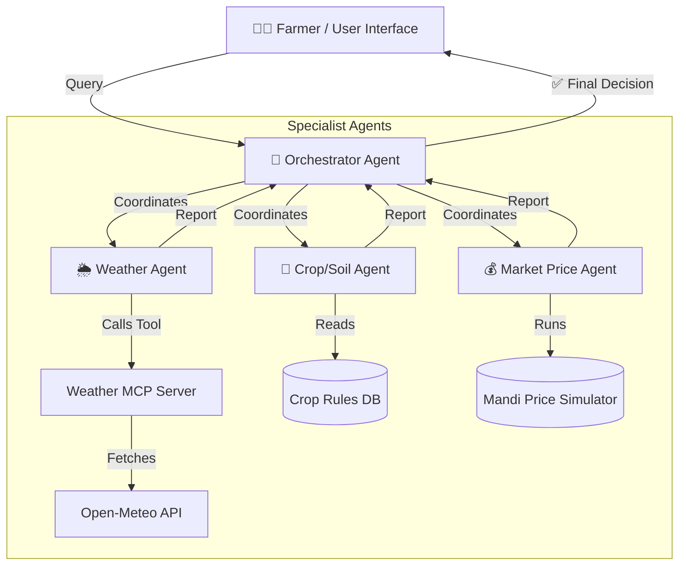

<div align="center">

# 🌾 KisanMitra (Farmer's Friend)
### AI Multi-Agent System for Indian Farmers

**Kaggle "Agents for Good" Capstone Project**

[](https://kisan-mitra-kaq6sn90c-sagun-bajpais-projects.vercel.app)
[](https://kisan-mitra-backend-wbqb.onrender.com)
[]()

</div>

---

## 📌 What is KisanMitra?

Indian farmers must combine **three different sources of information** —
weather, soil suitability, and market prices — before making a single
decision like *"Should I sell my wheat now, or wait?"*

**KisanMitra solves this** by using **4 specialized AI agents** that work
together and give the farmer **one simple, trustworthy answer** in both
**English and Hindi**.

> Example output:
> *"Wait 3 days to sell wheat — rain is expected, and prices are
> projected to rise by 6%."*

---

## 🎥 Live Demo

**🔗 Try it yourself:** [kisan-mitra-ai.vercel.app](https://kisan-mitra-kaq6sn90c-sagun-bajpais-projects.vercel.app)

<!--
  📸 ADD SCREENSHOT HERE: Homepage screenshot showing crop/soil/location selection
  Save as: screenshots/01-homepage.png
-->


<!--
  📸 ADD SCREENSHOT HERE: Final result page showing "SELL NOW" or "HOLD/WAIT" recommendation
  Save as: screenshots/02-recommendation.png
-->


<!--
  📸 ADD SCREENSHOT HERE: Transparency panel showing all 3 agent reports side by side
  Save as: screenshots/03-agent-breakdown.png
-->


<!--
  📸 ADD SCREENSHOT HERE: The mandi price forecast chart (line graph)
  Save as: screenshots/04-price-chart.png
-->


---

## 🏗️ System Architecture

KisanMitra uses a **hierarchical multi-agent coordination pattern** — one
"manager" agent (Orchestrator) talks to three "specialist" agents, then
combines their answers into a single decision.



| Agent | What It Does |
|---|---|
| 🧠 **Orchestrator Agent** | The "manager." Runs the other 3 agents in parallel, then uses Gemini to combine their reports into one final recommendation (Sell Now / Hold / Wait) in English + Hindi. |
| 🌦️ **Weather Agent** | Fetches live weather forecasts via the Weather MCP Server, and turns raw data into farming advice (e.g. "don't spray pesticide, rain is coming"). |
| 🌱 **Crop/Soil Agent** | Checks if the selected crop suits the selected soil type, using a rule-based database (wheat, rice, cotton, mustard, sugarcane). |
| 💰 **Market Price Agent** | Simulates 30-day historical + 7-day projected mandi prices vs. Government MSP, and gives a Sell/Hold verdict. |
| 🔌 **Weather MCP Server** | A tool server (using the official Model Context Protocol SDK) that wraps the free Open-Meteo weather API. |

---

## 🛠️ Tech Stack

| Layer | Technology |
|---|---|
| **Frontend** | Next.js 15, React, TypeScript, Tailwind CSS v4, Recharts |
| **Backend** | Node.js, Express.js (REST API) |
| **AI Engine** | Google Gemini (`gemini-2.5-flash`) via `@google/genai` SDK |
| **Agent Protocol** | Model Context Protocol (MCP) — Stdio transport |
| **Frontend Hosting** | Vercel |
| **Backend Hosting** | Render |

---

## ✨ Key Features

- ✅ **4 AI agents working together** for one holistic decision
- ✅ **Bilingual** — full Hindi + English support
- ✅ **Visual price forecast chart** (historical + 7-day projected + MSP line)
- ✅ **Crash-proof fallback logic** — if Gemini's API quota runs out, the app still gives a safe, rule-based answer instead of breaking
- ✅ **Transparency Panel** — farmer can see *why* the AI gave that advice, from each individual agent

---

## 🚀 Run It Locally

### Prerequisites
- Node.js v18+ (tested on v24)
- A free Gemini API key from [Google AI Studio](https://aistudio.google.com/)

### 1. Install dependencies
```bash
npm install
cd mcp-server && npm install && cd ..
cd backend && npm install && cd ..
cd frontend && npm install && cd ..
```

### 2. Add your Gemini API key
```bash
cp backend/.env.example backend/.env
```
Open `backend/.env` and paste:
```env
PORT=5000
GEMINI_API_KEY=your_actual_key_here
```

### 3. (Optional) Run verification tests
```bash
cd backend
node test-mcp.js       # tests Weather MCP Server
node test-agents.js    # tests the full agent pipeline
```

### 4. Start the app
```bash
# Terminal 1
cd backend && npm run dev     # runs on http://localhost:5000

# Terminal 2
cd frontend && npm run dev    # runs on http://localhost:3000
```
Open **http://localhost:3000** in your browser. 🎉

---

## 🌐 Deployment

| Part | Platform | Live URL |
|---|---|---|
| Frontend | Vercel | `https://kisan-mitra-kaq6sn90c-sagun-bajpais-projects.vercel.app` |
| Backend | Render | `https://kisan-mitra-backend-wbqb.onrender.com` |

<details>
<summary><b>📖 Click to expand: Full deployment steps</b></summary>

**Backend (Render):**
1. Create a **New Web Service** on [Render](https://render.com), connect your GitHub repo.
2. Root Directory: `.` (project root)
3. Build Command: `npm install && cd backend && npm install`
4. Start Command: `node backend/server.js`
5. Add Environment Variable: `GEMINI_API_KEY`

**Frontend (Vercel):**
1. Import your GitHub repo on [Vercel](https://vercel.com).
2. Root Directory: `frontend`
3. Add Environment Variable: `NEXT_PUBLIC_API_URL` = your Render backend URL

</details>

---

## 🔒 Security & Privacy

- 🔑 API keys are stored only in server-side environment variables — never exposed to the frontend or hardcoded.
- 🙅 **No personal data collected** — only crop type, soil type, and general region are needed. No names, phone numbers, or exact farm coordinates.
- 🛡️ **Fallback resilience** — if the Gemini API is rate-limited, the app safely switches to rule-based advice instead of crashing.

---

## 👤 Author

**Sagun Bajpai**
Built for the Kaggle "5-Day AI Agents: Intensive Vibe Coding Course with Google" Capstone Project.
